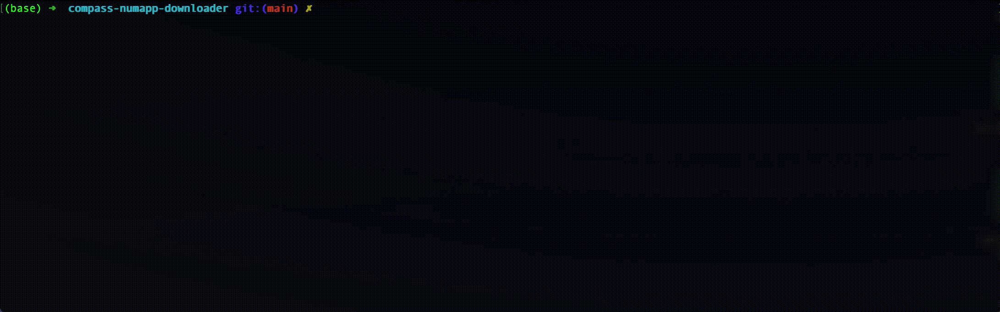

= COMPASS Questionnaire Response Downloader

https://github.com/NUMde/compass-numapp[Main Repository] | link:./docs[Downloader Documentation]

This Python project allows for an authenticated download of latest questionnaire response objects via the mobile backend. The retrieved objects are validated and decrypted.

Refer to the link:./docs[docs] for detailed information on configuration and usage of the script as well as the download api.

== Functionality

The script provides the following functions which are executed in the given order:

1. *Request of authentication token for requests to the mobile backend*: 
The authentication credentials are AES encrypted and the random key used for the latter is RSA encrypted. Both ciphers are submitted in request payload together with the random initialization vector used for the AES encryption.

2. *Using pagination, all current data is retrieved from the queue*:
This action is performed via a request to the download api of the mobile backend. 
The responses are written to a file as the intermediate result. The response for every page contains a JWS token which is verified. If the RSA SHA 256 signature  is valid, then the contained payload is extracted and used for further processing.

3. *Decryption of validated questionnaire responses*:
The questionnaire responses which were validated in the previous step are decrypted (RSA PKCS#7) with the private key and certificate. The results are written to a file.

4. *Delete retrieved questionnaire responses from queue*:
All elements that have been decrypted in step 3 are deleted via the mobile backend based on their UUID identifiers.

