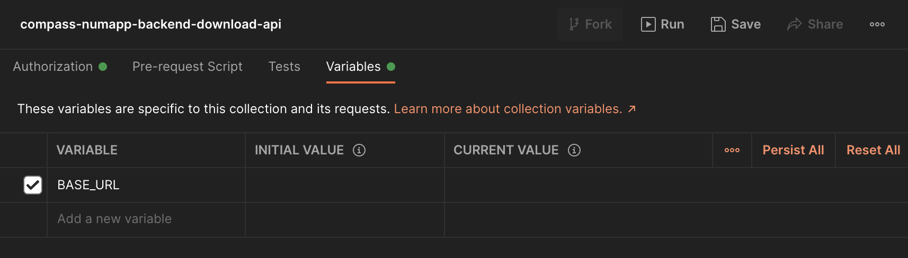
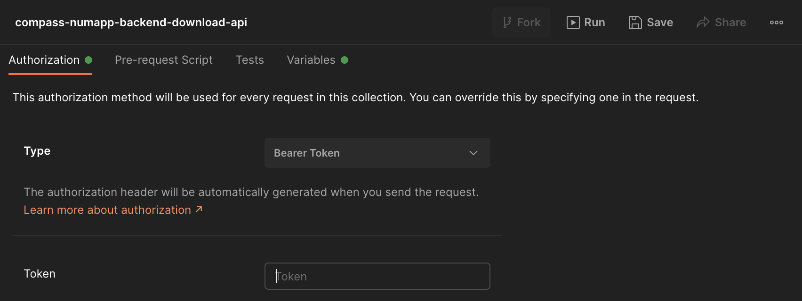

link:../README.adoc[← Table of Contents]

== Postman

You can use the https://learning.postman.com/[Postman] collection in the ./postman directory to directly access the download api of the mobile backend. The collection contains a sample request that you can use to download (encrypted) questionnaire response objects from the database via the mobile backend.

=== Prerequisites

You must define the (current) value of the _base_url_ variable (URL for mobile backend) in the collection's corresponding _Variables_ tab. This variable must not end with '/' to ensure URL and path are connected successfully.

The download api of the mobile backend requires authentication, therefore, you must first request an authentication token via the /auth route. To obtain this token use the Docker image of the downloader script (described above) and overwrite the command when running it:

[source,shell]
----
$ make get-token
----

Set this token as the value for the _Bearer Token_ in the _Authorization Tab_ of the Postman collection. As the token expires, you might have to update it for future requests.

